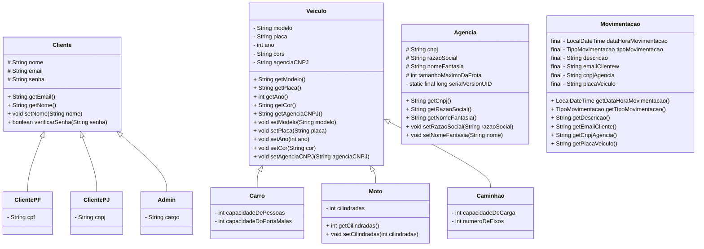

# Locadora de veículos

Criar uma aplicação que gerencie o aluguel de veículos, onde cada item abaixo seja considerado:

## Diagrama de Classe

## Itens obrigatórios

- [x] Cadastrar os veículos;
- [ ] Alterar um veículo cadastrado;
- [x] Buscar um veículo por parte do nome;
- [x] Cadastrar a agência onde o veículo será alugado/devolvido;
- [x] Alterar a agência onde o veículo será alugado/devolvido;
- [x] Buscar uma agência por parte do nome ou do logradouro do endereço;
- [x] Cadastrar o cliente (pessoa fisica/juridica)
- [x] Alterar o cliente (pessoa fisica/juridica)
- [ ] Alugar um veículo para pessoa fisica;
- [ ] Alugar um veículo para pessoa juridica;
- [ ] Devolver um veículo para pessoa fisica;
- [ ] Devolver um veículo para pessoa juridica;
- [ ] Gerar um comprovante com todos os dados do aluguel (aberto para o grupo decidir o que vai ser demonstrado);
- [ ] Gerar um comprovante com todos os dados da devolução (aberto para o grupo decidir o que vai ser demonstrado);

## Itens bônus

- [x] Paginar as listas envolvidas;
- [ ] Dados sendo gravados em arquivos, simulando uma base de dados;

## Regras de negócio

> [!IMPORTANT]
> - [x] RN1: Os veículos não podem ser repetidos;
> - [x] RN2: Tipos de veículos que serão considerados: Carro, Moto, Caminhões;
> - [x] RN3: Os aluguéis e devoluções terão o local, data e horario;
> - [ ] RN4: Os veículos que estiverem alugados não poderão estar disponíveis;
> - [x] RN5: Agências não podem estar duplicadas;
> - [x] RN6: Clientes não podem estar duplicados;
> - [ ] RN7: Regras de devolução: 
>    - Caso pessoa fisica tenha ficado com o carro mais que 5 dias terá direito a 5% de desconto. 
>    - Caso pessoa juridica tenha ficado com o carro mais que 3 dias terá direito a 10% de desconto.

> [!NOTE]
> ### Valores-base da diária por tipo de veículo
> 
> *Tipo de Veículo Valor por dia:*
> _____________________
>  Moto R$ 100,00
> _____________________
>  Carro R$ 150,00
> _____________________
>  Caminhão R$ 200,0

# Entregaveis

- Documentacao no REAMDE.md, com os diagramas das classes principais;
- Realizar uma apresentação apresentando os pontos mais desafiadores do projeto, os perrengues
- passados e um resumo do que foi entregue e o que não pode ser entregue;
    - Demonstrar onde foram aplicados os pontos aprendidos nesse módulo;
    - Destacando os príncipios SOLID aplicados, e os que não foram utilizados o porquê
